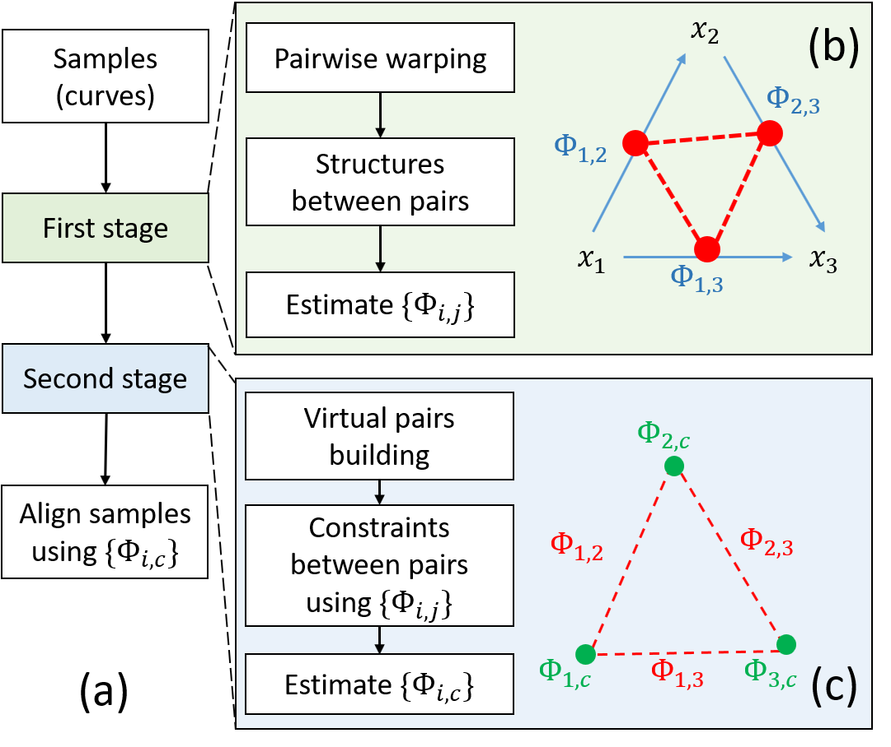

ncGTW
=====

The purpose of ncGTW is to detect and fix the bad alignments in the
LC-MS data. Currently, ncGTW is implemented in a R-package as a plug-in
for XCMS. That is, ncGTW can detect the misaligned feature groups from
XCMS and realign them. After that, XCMS can use the realigned data from
XCMS for more accurate grouping and peak-filling.


Installation
------------

You can install the latest version of ncGTW from GitHub by

``` r
devtools::install_github("ChiungTingWu/ncGTW")
```

Algorithm overview
------------------

ncGTW detects the misaligned features with two criterions. First, ncGTW
algorithm estimates the p-value of each feature using higher resolution
alignment result, where the p-value is given by the null hypothesis with
accurate alignment. Second, we identifies all features with sufficiently
small p-values and disjoint sample subsets. Then, ncGTW algorithm
matches the neighboring features to the corresponding features produced
by lower resolution alignment, and consider realigning these features.


To realign the misaligned features, we proposed a new multiple alignment
method, which is reference free and can incorporate the structure
information in the dataset. There are two core ideas. First, instead of
set a certain reference, ncGTW performs all possible pairwise alignments
between each two sample with the structure information in the dataset.
Second, with all the pairwise alignment as constraints, ncGTW estimates
the warping functions for all sample to a coordinate.


